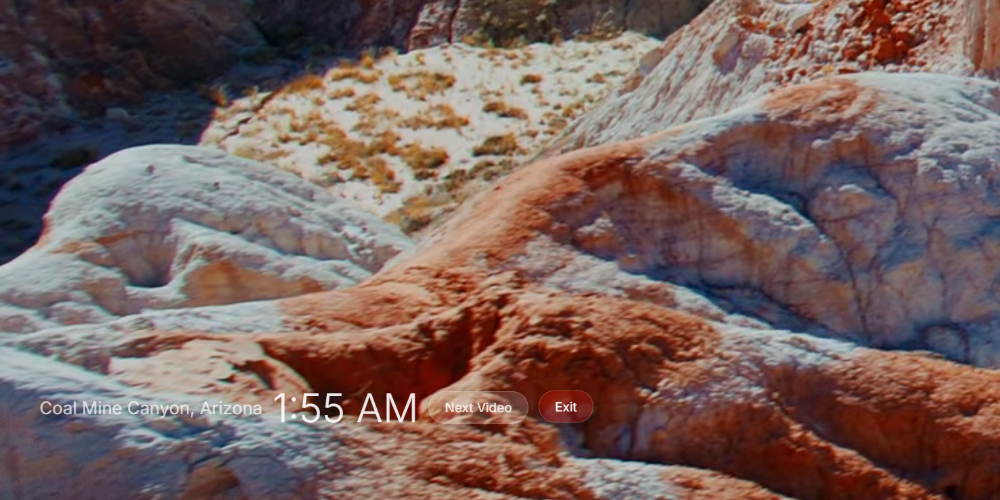

# WinAerials
Run Apple's latest Aerial videos as a simple screensaver via Edge

{:width="300px"}

# Install & Run

### Screensaver only
1. Install [.Net 10 SDK](https://dotnet.microsoft.com/en-us/download/dotnet/10.0) 
1. Add all [Apple Root Certs](https://www.apple.com/certificateauthority/) to Machine > Trusted Root Cert Authority - this enables pulling videos from Apple's web servers without SSL cert problems
1. Clone the repo to a preferred local folder
1. Edit obvious paths in config.yaml
1. Launch `RunMeOnce.cmd` first time to download and cache all the latest video URLs and shuffle them into playlist.js
1. then `FullScreenMe.cmd` is the script that runs edge in fullscreen mode. Create a shortcut and map a hotkey if you like.

### Lively support (**optional** versus pure screensaver)
1. Install [Lively Wallpapers](https://www.rocksdanister.com/lively/) to run the video as a desktop background wallpaper 
   - In my humble opinion it's too distracting to get any real work done
   - I am pretty sure the setup exe install will work better than ms store version due to permissioning.
1. Run SymLinkMe.cmd to add the repo folder to %LocalAppData%\Lively Wallpaper\Library\wallpapers - once Lively is restarted, new "Aerials" wallpaper entry should show in the Library (definition comes from LivelyInfo.json)
1. Launch via Lively for desktop wallpaper mode

# References
- [Apple TV Screen Saver Compilation](https://www.youtube.com/watch?v=Wb5r3dr70xI)
- [Lively Wallpaper app](https://apps.microsoft.com/detail/9ntm2qc6qws7)

# Notes
- There's of course other cracks at this out there ([OrangeJedi/Aerial](https://github.com/OrangeJedi/Aerial) etc) with more implemenation complexity than i was hoping to see so this overall implementation is meant to be approachable for tweaking:
  - RunMeOnce.cmd runs WinAerials.cs which populates playlist.js
  - LivelyPage.html walks playlist.js and plays the videos
  - that's really it, all the code is scripted, no binaries, so it's wide open for mods and fixes - hack away!
- if Apple updates it's videos:
  1. update the video sources path in [config.yaml](config.yaml)
  2. delete playlist.js and
  3. RunMeOnce.cmd again to download the latest
- Run **pre-configured** Lively wallpaper from command line:
  - `& "C:\Program Files\Lively Wallpaper\Lively.exe" setwp --file "$($env:LocalAppData)\Lively Wallpaper\Library\wallpapers\WinAerials"`
- Stop running lively wallpaper from command line:
  - StopMe.cmd
